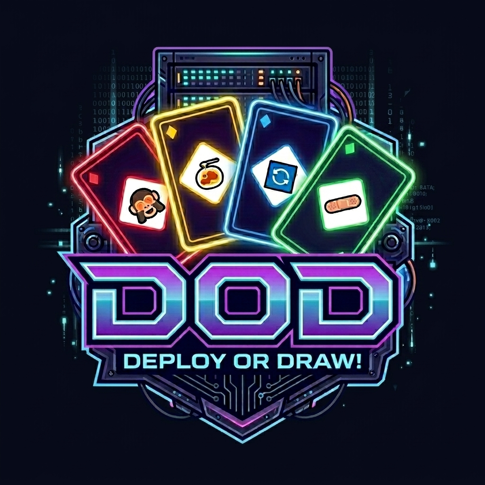
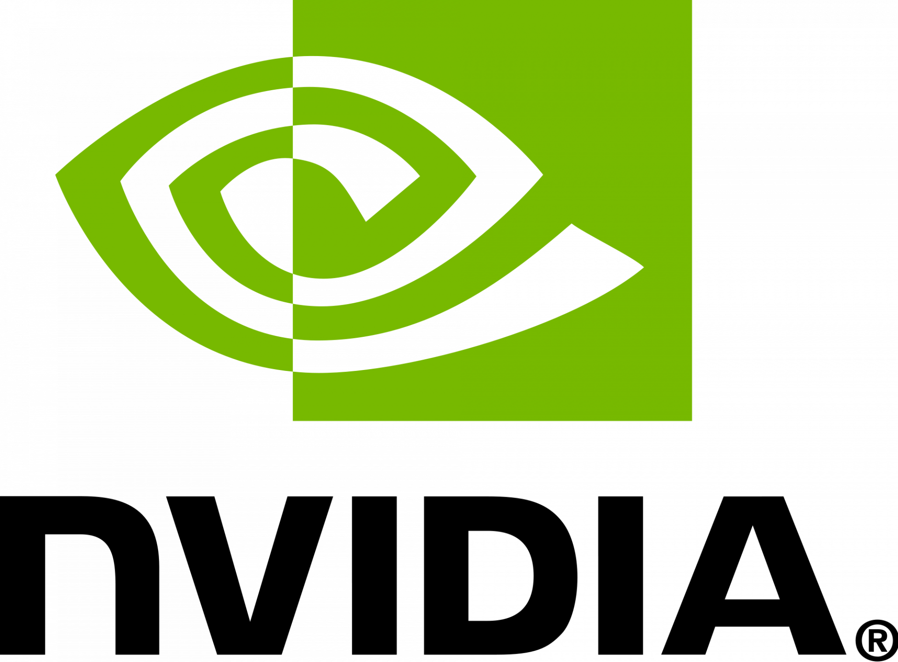

<p align="center">
  
</p>

<h1 align="center">DOD - Deploy or Draw</h1>

<p align="center">
  <a href="https://huggingface.co/spaces/build-small-hackathon/dod-uno">
    
  </a>
</p>

<p align="center">
  <strong>Um jogo UNO multiplayer onde incidentes de produção viram caos, comédia e drama de mesa movido por IA.</strong>
</p>

DOD - (Deploy or Draw) é um jogo UNO multiplayer com tema de engenharia de software, criado para o **Build Small Hackathon**. Os jogadores correm para resolver uma crise de produção antes que o medidor de pânico do Diretor exploda, enquanto um oponente de IA toma decisões estratégicas e um Diretor de IA reage a cada jogada com falas curtas, dramáticas, bilíngues e narradas.

Este não é apenas um jogo de cartas com IA por cima. A IA sustenta a experiência: o Nemotron joga como rival obrigatório, o Diretor improvisa comentários contextualizados pela crise, e o VoxCPM2 transforma essas reações em conversa de mesa no estilo arcade. O resultado é um brinquedo estranho de noite de deploy: parte UNO, parte sala de guerra de incidente, parte teatro corporativo absurdo.

Criado com componentes HTML customizados em Gradio, Hugging Face Spaces, NVIDIA Nemotron Nano 4B e VoxCPM2.

## Pré-requisitos

- Python 3.10 exatamente. Os requisitos do LLM local e do NanoVLLM usam wheels pré-compiladas `cp310-cp310` para evitar builds nativos no Windows.
- Git com suporte a submódulos
- `uv`
- GPU NVIDIA CUDA para o serviço local de TTS NanoVLLM/VoxCPM
- Conta/token Hugging Face apenas se você usar datasets remotos privados, quiser persistência autenticada do leaderboard, ou fizer deploy com login OAuth em um Space

Instale o `uv` se necessário:

```bash
pip install uv
```

Se a instalação de dependências informar que uma wheel `cp310-cp310` é incompatível, confira se o ambiente virtual está usando Python 3.10. Essas wheels foram travadas de propósito para que usuários Windows não precisem instalar o Visual Studio Build Tools para compilação nativa.

## Requisitos de Hardware

Inferência local requer uma GPU NVIDIA CUDA.

- Apenas servidor LLM local: use uma GPU com pelo menos 4 GB de VRAM.
- Servidor LLM local mais TTS local com NanoVLLM: use pelo menos 12 GB de VRAM para uma boa experiência de jogo.
- Windows com 8 GB de VRAM às vezes consegue rodar ambos os serviços porque a memória compartilhada da GPU pode transbordar para a RAM do sistema, mas espere geração de áudio mais lenta e atraso nas falas do Diretor.
- Se a memória da GPU ficar saturada, o TTS pode ficar lento a ponto de entregar áudios atrasados, e o servidor LLM também pode responder mais devagar porque os dois serviços estarão competindo por memória.
- Linux geralmente não oferece o mesmo comportamento prático de transbordamento para memória compartilhada nesse workload, então 8 GB de VRAM não é recomendado para rodar os dois serviços locais. Use 12 GB de VRAM ou mais.

Se sua GPU tem pouca VRAM, use uma destas configurações mais leves:

- rode apenas o LLM local e defina `DOD_DISABLE_TTS=True`
- rode o LLM local e use Modal para TTS
- use endpoints remotos para LLM e TTS

## Clone

Clone o repositório com submódulos:

```bash
git clone --recurse-submodules https://github.com/DEVAIEXP/doduno.git
cd doduno
```

Se você já clonou sem submódulos:

```bash
git submodule update --init --recursive
```

O submódulo `dod-llm-server` é necessário quando você roda o serviço LLM localmente.

## Arquivo de Ambiente

Crie seu arquivo de ambiente local a partir do exemplo:

Windows PowerShell:

```powershell
Copy-Item .env.example .env
```

Linux/macOS:

```bash
cp .env.example .env
```

Para um setup de desenvolvimento totalmente local, use este formato:

```env
DOD_USE_LOCAL_DATA=True
DOD_DISABLE_TTS=False
DOD_DISABLE_LOGS=False
DOD_USE_LOCAL_API=True
DOD_MAX_PLAYERS=2
DOD_MIN_PLAYERS_TO_START=2
DOD_LOBBY_START_COUNTDOWN_SECONDS=30
DOD_TURN_HANDOFF_DELAY_SECONDS=6
DOD_BOT_TURN_HANDOFF_MULTIPLIER=2
DOD_ENABLE_AGENT_TRACES=True
DOD_UPLOAD_AGENT_TRACES=True
DOD_AGENT_TRACE_DATASET_REPO_ID=build-small-hackathon/dod-agent-traces

TTS_API_URL=http://127.0.0.1:8000
TTS_API_MODE=gradio
LLM_URL=http://127.0.0.1:7880

TTS_API_KEY=your_local_tts_key
LLM_API_KEY=your_local_llm_key
# Opcional, apenas para datasets remotos privados:
# HF_TOKEN_DATASET=your_huggingface_dataset_token
```

Para desenvolvimento somente local, `TTS_API_KEY` e `LLM_API_KEY` são principalmente valores de passagem usados pelo jogo ao chamar as APIs locais. Eles podem ter qualquer valor, desde que o jogo e o serviço local concordem com o mesmo valor. Trate-os como segredos reais apenas quando o serviço estiver exposto remotamente, via túnel público ou deploy fora da sua máquina.

`DOD_MAX_PLAYERS` controla o tamanho da sala ativa e inclui o bot obrigatório Nemotron. Por exemplo, `DOD_MAX_PLAYERS=3` significa até dois jogadores humanos mais Nemotron. `DOD_MIN_PLAYERS_TO_START` controla quando o countdown do lobby pode começar, e `DOD_LOBBY_START_COUNTDOWN_SECONDS` controla por quanto tempo o lobby espera mais jogadores antes de iniciar.

`DOD_TURN_HANDOFF_DELAY_SECONDS` adiciona uma pausa curta depois que um turno termina, antes que o próximo jogador, ou o Nemotron, possa agir. Isso dá um pouco de espaço para a fala e o áudio do Diretor chegarem, em vez de deixar os turnos emendarem instantaneamente.

`DOD_BOT_TURN_HANDOFF_MULTIPLIER` aumenta essa pausa apenas antes do Nemotron agir. Por exemplo, com `DOD_TURN_HANDOFF_DELAY_SECONDS=6` e `DOD_BOT_TURN_HANDOFF_MULTIPLIER=2`, humanos esperam cerca de 6 segundos entre turnos, enquanto o Nemotron espera cerca de 12 segundos antes de jogar.

Defina `DOD_DISABLE_TTS=True` se quiser execuções de desenvolvimento mais rápidas sem chamar o serviço de TTS. As falas do Diretor ainda aparecerão como texto no log da partida, mas não serão audíveis.

Defina `DOD_DISABLE_LOGS=True` para ocultar logs operacionais de console criados pelo app, como warmup, mapper, TTS e mensagens de conexão. Erros e decisões compactas do bot ainda aparecem. Isso não afeta o log do servidor exibido dentro da UI da partida.

`DOD_ENABLE_AGENT_TRACES=True` grava traces leves em JSONL para as decisões do Nemotron e as reações do Diretor de TI. Esses traces incluem entrada do modelo, saída bruta do modelo, saída aceita pelo backend, status de fallback e latência. O arquivo local padrão é `dod_agent_traces.jsonl` e ele é ignorado pelo git.

`DOD_UPLOAD_AGENT_TRACES=True` envia o JSONL de traces para o dataset configurado em `DOD_AGENT_TRACE_DATASET_REPO_ID`. O dataset padrão é `build-small-hackathon/dod-agent-traces`. O upload usa `HF_TOKEN_DATASET`, então use `DOD_UPLOAD_AGENT_TRACES=False` se quiser manter os traces apenas localmente ou se não tiver permissão de escrita no dataset.

`HF_TOKEN_DATASET` não é necessário para os downloads públicos de modelos usados pelos serviços locais. Configure-o apenas quando seus datasets de inference mapper ou leaderboard forem privados, ou quando seu ambiente de deploy precisar de acesso autenticado ao Hugging Face Hub. Crie esse token na página de configurações da sua conta Hugging Face em **Access Tokens**, depois cole como `HF_TOKEN_DATASET` no `.env`.

Para testes locais de OAuth, o Gradio usa as credenciais Hugging Face disponíveis na sua máquina. Mantenha `HF_TOKEN` fora do `.env`; este app usa `HF_TOKEN_DATASET` para datasets privados para não sobrescrever o `hf auth login`. Se você vir um erro `401 Unauthorized` vindo de `whoami-v2`, remova valores inválidos de `HF_TOKEN` do ambiente do shell ou rode `hf auth login` com uma conta válida.

O servidor LLM local roda de dentro do submódulo `dod-llm-server`, então ele precisa do próprio arquivo `.env`. Copie o exemplo dele e use o mesmo valor de `LLM_API_KEY` configurado no `.env` da raiz:

Windows PowerShell:

```powershell
Copy-Item dod-llm-server\.env.example dod-llm-server\.env
```

Linux/macOS:

```bash
cp dod-llm-server/.env.example dod-llm-server/.env
```

Quando `DOD_USE_LOCAL_DATA=True`, o app lê dados locais em:

- Windows: `%USERPROFILE%\.dod\inference_map.json`
- Windows: `%USERPROFILE%\.dod\leaderboard.csv`
- Linux/macOS: `~/.dod/inference_map.json`
- Linux/macOS: `~/.dod/leaderboard.csv`

O `inference_map.json` local só é necessário quando `DOD_USE_LOCAL_API=False`, porque nesse modo o jogo resolve endpoints de LLM/TTS pelo mapper. Quando `DOD_USE_LOCAL_API=True`, o jogo usa `LLM_URL` e `TTS_API_URL` diretamente e não precisa do `inference_map.json`.

O app não cria `inference_map.json` automaticamente. Crie esse arquivo quando usar dados locais junto com resolução de endpoints baseada no mapper. Um endpoint `fallback` é opcional: se você fornecer apenas `primary`, o app roda com um único endpoint e simplesmente não terá backup se esse endpoint falhar.

Quando `DOD_USE_LOCAL_API=True`, o app usa `LLM_URL` e `TTS_API_URL` diretamente em vez do inference mapper remoto.

## Instalar o Jogo Principal

Windows PowerShell:

```powershell
uv venv .venv --python 3.10
uv pip install --system-certs --python .\.venv\Scripts\python.exe -r requirements.txt
```

Linux/macOS:

```bash
uv venv .venv --python 3.10
uv pip install --system-certs --python .venv/bin/python -r requirements.txt
```

## Instalar o Servidor LLM Local

O servidor LLM local fica no submódulo `dod-llm-server` e usa `requirements_local.txt` fora do Hugging Face Spaces.

Windows PowerShell:

```powershell
cd dod-llm-server
uv venv .venv --python 3.10
uv pip install --system-certs --python .\.venv\Scripts\python.exe -r requirements_local.txt
cd ..
```

Linux/macOS:

```bash
cd dod-llm-server
uv venv .venv --python 3.10
uv pip install --system-certs --python .venv/bin/python -r requirements_local.txt
cd ..
```

O servidor LLM local inicia na porta `7880`.

## Instalar o Servidor TTS Local NanoVLLM

Use um ambiente virtual separado para NanoVLLM/VoxCPM, para que as dependências CUDA e de áudio não colidam com o ambiente do jogo principal.

Windows PowerShell:

```powershell
uv venv .venv-nanovllm --python 3.10
uv pip install --system-certs --python .\.venv-nanovllm\Scripts\python.exe -r requirements_nanovllm.txt
```

Linux/macOS:

```bash
uv venv .venv-nanovllm --python 3.10
uv pip install --system-certs --python .venv-nanovllm/bin/python -r requirements_nanovllm.txt
```

O servidor TTS local inicia na porta `8000` e expõe o endpoint Gradio API `/generate_api`.

Se preferir rodar TTS na Modal em vez da sua GPU local, siga [Configuração do TTS na Modal](MODAL_TTS_SETUP-pt-BR.md).

## Preparar Dados Locais

Crie estes dados antes de iniciar o jogo principal quando os dois valores forem verdadeiros:

- `DOD_USE_LOCAL_DATA=True`
- `DOD_USE_LOCAL_API=False`

Nesse modo, o app lê o roteamento de endpoints pelo arquivo mapper local. Se `DOD_USE_LOCAL_API=True`, você pode pular o `inference_map.json`, porque o jogo usa `LLM_URL` e `TTS_API_URL` diretamente.

Crie o diretório local de dados:

Windows PowerShell:

```powershell
New-Item -ItemType Directory -Force $HOME\.dod
```

Linux/macOS:

```bash
mkdir -p ~/.dod
```

Caminho local do mapper:

- Windows: `%USERPROFILE%\.dod\inference_map.json`
- Linux/macOS: `~/.dod/inference_map.json`

Exemplo de `inference_map.json`:

```json
{
  "llm": {
    "primary": {
      "name": "local-llm",
      "url": "http://127.0.0.1:7880",
      "mode": "gradio",
      "timeout": 30,
      "warmup_timeout": 75,
      "cooldown_seconds": 180
    },
    "fallback": {
      "name": "backup-llm",
      "url": "https://your-backup-llm.example.com",
      "mode": "gradio",
      "timeout": 30,
      "warmup_timeout": 75,
      "cooldown_seconds": 180
    }
  },
  "tts": {
    "primary": {
      "name": "local-tts",
      "url": "http://127.0.0.1:8000",
      "mode": "gradio",
      "timeout": 25,
      "warmup_timeout": 75,
      "cooldown_seconds": 180
    },
    "fallback": {
      "name": "backup-tts",
      "url": "https://your-backup-tts.example.com",
      "mode": "rest",
      "timeout": 25,
      "warmup_timeout": 75,
      "cooldown_seconds": 180
    }
  }
}
```

As entradas `fallback` são opcionais. Se você fornecer apenas `primary`, o app roda com um endpoint e sem backup.

O mapper monta uma cadeia de endpoints para `llm` e outra para `tts`. Por padrão, o jogo tenta `primary` primeiro. Se esse endpoint falhar ou expirar, ele é colocado temporariamente em cooldown e o jogo tenta `fallback` em seguida. Endpoints adicionais de fallback podem ser listados em `fallbacks`.

Você pode mudar qual endpoint é testado primeiro sem editar o JSON:

```env
LLM_URL_PRIORITY=primary
TTS_URL_PRIORITY=primary
```

Use `fallback` quando quiser testar o endpoint de backup primeiro:

```env
LLM_URL_PRIORITY=fallback
TTS_URL_PRIORITY=fallback
```

Essas variáveis de prioridade são independentes, então você pode testar o TTS fallback mantendo o LLM primary, ou o contrário. Elas só se aplicam quando a cadeia tem mais de um endpoint. Se `DOD_USE_LOCAL_API=True`, o mapper é ignorado e essas variáveis de prioridade não são usadas.

Caminho local do leaderboard:

- Windows: `%USERPROFILE%\.dod\leaderboard.csv`
- Linux/macOS: `~/.dod/leaderboard.csv`

O arquivo de leaderboard é opcional. Se ele não existir, o app inicia com um leaderboard local vazio e cria o CSV quando salvar resultados.

Exemplo de `leaderboard.csv`:

```csv
player_name,wins,losses,xp,games_played,picture_url
Nemotron,0,0,0,0,assets/nemotron.jpg
```

## Datasets Remotos Opcionais

Use este modo quando quiser que o inference mapper, o leaderboard e os traces opcionais de agente fiquem em repositórios Hugging Face Dataset em vez de arquivos locais.

Crie repositórios Hugging Face do tipo **Dataset**:

- um dataset para `inference_map.json`
- um dataset para `leaderboard.csv`
- opcionalmente, um dataset para `dod_agent_traces.jsonl`

Depois configure o `.env` da raiz assim:

```env
DOD_USE_LOCAL_DATA=False
DOD_INFERENCE_MAPPER_DATASET_REPO_ID=your-user-or-org/your-inference-mapper-dataset
DOD_INFERENCE_MAPPER_DATASET_REVISION=main
DOD_LEADERBOARD_DATASET_REPO_ID=your-user-or-org/your-leaderboard-dataset
DOD_ENABLE_AGENT_TRACES=True
DOD_UPLOAD_AGENT_TRACES=True
DOD_AGENT_TRACE_DATASET_REPO_ID=your-user-or-org/your-agent-traces-dataset
```

Se algum dataset for privado, crie um token de acesso na página de configurações da sua conta Hugging Face em **Access Tokens** e defina:

```env
HF_TOKEN_DATASET=your_huggingface_dataset_token
```

O dataset do inference mapper precisa conter `inference_map.json`. O dataset do leaderboard usa `leaderboard.csv`; se ele ainda não existir, o app começa com um leaderboard vazio e cria o arquivo ao salvar resultados. O dataset de traces de agente recebe registros JSONL append-only em `dod_agent_traces.jsonl`; se o upload estiver desativado, os traces ficam apenas locais.

## Rodar Localmente

Inicie cada serviço em um terminal separado.

### Terminal 1: Servidor LLM

Windows PowerShell:

```powershell
cd dod-llm-server
.\.venv\Scripts\python.exe app.py
```

Linux/macOS:

```bash
cd dod-llm-server
.venv/bin/python app.py
```

URL local esperada:

```text
http://127.0.0.1:7880
```

O servidor LLM local faz bind em `0.0.0.0` para permitir tunelamento quando necessário, mas na mesma máquina você deve acessá-lo por `http://127.0.0.1:7880`.

### Terminal 2: Servidor TTS

Windows PowerShell:

```powershell
.\.venv-nanovllm\Scripts\python.exe nanovllm_gradio_local.py
```

Linux/macOS:

```bash
.venv-nanovllm/bin/python nanovllm_gradio_local.py
```

URL local esperada:

```text
http://127.0.0.1:8000
```

O servidor TTS local também faz bind em `0.0.0.0` para tunelamento, mas o jogo local deve chamá-lo por `http://127.0.0.1:8000`.

### Terminal 3: Jogo Principal

Windows PowerShell:

```powershell
.\.venv\Scripts\python.exe app.py
```

Linux/macOS:

```bash
.venv/bin/python app.py
```

Abra a URL do Gradio exibida no terminal.

## Validação

Rode uma checagem de sintaxe a partir da raiz do repositório:

Windows PowerShell:

```powershell
.\.venv\Scripts\python.exe -m py_compile app.py components.py game_manager.py prompts.py inference_mapper.py
```

Linux/macOS:

```bash
.venv/bin/python -m py_compile app.py components.py game_manager.py prompts.py inference_mapper.py
```

## Observações

- O jogo principal usa componentes customizados `gr.HTML` do Gradio. Não substitua o tabuleiro por botões Gradio comuns ou por uma string HTML estática.
- O OAuth do Hugging Face funciona completamente dentro de um Hugging Face Space. Localmente, o Gradio pode simular o login se sua máquina estiver autenticada no Hugging Face.
- Use `DOD_DISABLE_TTS=True` quando quiser testar a jogabilidade sem esperar síntese de áudio.
- Use `DOD_USE_LOCAL_API=True` quando estiver rodando os serviços LLM e TTS na sua própria máquina.
- Use `DOD_ENABLE_AGENT_TRACES=True` para inspecionar turnos do Nemotron e geração de falas do Diretor após uma partida. Use `DOD_UPLOAD_AGENT_TRACES=False` se quiser manter os traces apenas localmente.

## Créditos

A geração de voz usa VoxCPM2 da OpenBMB. A inferência local e remota de gameplay com LLM usa NVIDIA Nemotron Nano 4B. O desenvolvimento teve assistência do OpenAI Codex com GPT-5.5. Criado com Gradio e Hugging Face Spaces para o Build Small Hackathon.

## Powered By

<p align="center">
  
  &nbsp;&nbsp;
  
  &nbsp;&nbsp;
  
  &nbsp;&nbsp;
  
  &nbsp;&nbsp;
  
</p>

## Licença

Este projeto está licenciado sob a Licença MIT. Veja [LICENSE](LICENSE).
